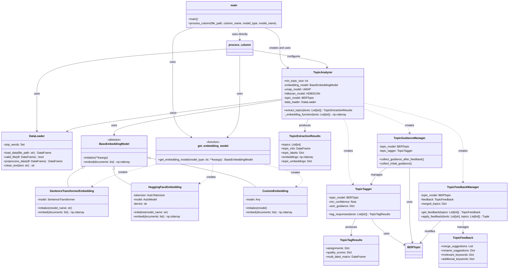

# Topic Analysis System

A robust system for analyzing and extracting topics from text data, combining advanced NLP techniques, Large Language Models (LLMs), and interactive feedback to provide reliable, interpretable topic modeling results.

## Overview

The Topic Analysis System consists of several integrated components:
- Topic extraction using BERTopic
- LLM-enhanced topic interpretation
- Interactive feedback collection
- Quality metrics calculation
- User guidance integration
- Web interface for visualization (Streamlit)
- Text preprocessing and cleaning

## Setup Instructions

### Prerequisites
```bash
# Required Python version
Python 3.10+

# Create and activate virtual environment
python -m venv venv
source venv/bin/activate  # Linux/Mac
venv\Scripts\activate     # Windows
```

### Installation
```bash
# Install required packages
pip install -r requirements.txt
```

### Required Dependencies
```
bertopic==0.16.4
hdbscan==0.8.39
numpy==1.26.4
pandas==2.2.3
plotly==5.24.1
scikit-learn==1.5.2
sentence-transformers==3.3.0
streamlit==1.40.1
torch==2.5.1
transformers==4.46.2
umap-learn==0.5.7
nltk==3.9.1
openpyxl==3.1.5
huggingface-hub==0.26.2
```

## Running the Application

```bash
# Run the Streamlit web interface
streamlit run scripts/app.py

# Or run the command-line interface
python scripts/main.py
```


## Large Language Model Integration

### Available Models

1. **Embedding Models**
   - Sentence Transformers
     ```python
     model_name = "all-MiniLM-L6-v2"
     embedding_model_type = "sentence-transformer"
     ```
   - Hugging Face Models
     ```python
     model_name = "bert-base-uncased"
     embedding_model_type = "hugging-face"
     ```
   - Custom Models
     ```python
     model = CustomEmbeddingModel()
     embedding_model_type = "custom"
     ```

### Model Selection Guide

1. **Sentence Transformers**
   - Fast and efficient
   - Good balance of performance and resource usage
   - Pre-optimized for semantic similarity
   - Example models:
     - all-MiniLM-L6-v2
     - paraphrase-multilingual-mpnet-base-v2
     - all-mpnet-base-v2

2. **Hugging Face Models**
   - More customization options
   - Larger model variety
   - Domain-specific models available
   - Example models:
     - bert-base-uncased
     - roberta-base
     - distilbert-base-uncased

3. **Custom Models**
   - Full control over embedding process
   - Custom preprocessing
   - Domain adaptation possible
   - Requires additional setup

### Usage Examples

```python
# In main.py
# Using Hugging Face 
model = "bert-base-uncased"
embedding_model_type = "hugging-face"

# Using Sentence Transformers
model = "all-MiniLM-L6-v2"
embedding_model_type = "sentence-transformer"

# Using Custom Model
class MyCustomEmbeddingModel:
    """Custom embedding model for text data. This class can be replaced with any other embedding model."""
    def __init__(self, base_model_name: str = "YourModel"):
        # Initialize with a base model
        self.base_model = SentenceTransformer(base_model_name)

    def embed(self, documents: List[str]) -> np.ndarray:
        # Custom preprocessing
        processed_docs = [doc.lower().strip() for doc in documents]

        # Get base embeddings
        embeddings = self.base_model.encode(processed_docs)

        # Add custom post-processing (e.g., normalization)
        normalized_embeddings = embeddings / np.linalg.norm(embeddings, axis=1)[:, np.newaxis]

        return normalized_embeddings

model = MyCustomEmbeddingModel()
embedding_model_type = "custom"


df = process_column(
        file_path=file_path,
        column_name=col,
        embedding_model_type=embedding_model_type,
        model=model,
        model_name=model,
    )

```

## Result Example

[Streamlit example](./result_example/resultats_analyse_topics.xlsx)
[CLI example](./result_example/topic_analysis_results.xlsx)

## System Architecture

The following class diagram illustrates the complete system architecture and component relationships:



### Component Description

#### Core Components
- **TopicAnalyzer**: Main analysis engine handling topic extraction and model management
- **DataLoader**: Handles data input, validation, and preprocessing
- **BaseEmbeddingModel**: Abstract base class for all embedding models

#### Embedding Models
- **SentenceTransformerEmbedding**: Implementation for Sentence Transformers
- **HuggingFaceEmbedding**: Implementation for Hugging Face models
- **CustomEmbedding**: Support for custom embedding models

#### Topic Management
- **TopicTagger**: Handles topic assignment and classification
- **TopicGuidanceManager**: Manages user guidance and feedback
- **TopicFeedbackManager**: Processes and applies user feedback

#### Result Classes
- **TopicExtractionResults**: Contains topic analysis results
- **TopicTagResults**: Stores topic assignments and quality metrics
- **TopicFeedback**: Maintains user feedback and suggestions


## System Components

### 1. Data Loading and Preprocessing
- Handles Excel file input
- Cleans and validates text data
- Removes duplicates and invalid entries
- Implements stopword removal and text normalization

### 2. Topic Analysis with LLM Integration
- BERTopic for base topic modeling
- LLM-enhanced topic interpretation
- Multiple embedding model support
- Interactive topic refinement
- Quality metrics calculation

### 3. User Interface
- Streamlit-based web interface
- Interactive topic visualization
- Real-time feedback integration
- Result export functionality
- Quality metric display

## Model Performance Evaluation

### Quality Metrics

The system calculates four main quality metrics:

1. **Topic Coherence (40%)**
   - Measures semantic coherence using LLM embeddings
   - Evaluates topic word relationships
   - Range: 0.0 to 1.0

2. **Topic Distinctiveness (30%)**
   - Uses embedding space distances
   - Measures inter-topic separation
   - Range: 0.0 to 1.0

3. **Document Coverage (20%)**
   - Meaningful topic assignment rate
   - Excludes outlier assignments
   - Range: 0.0 to 1.0

4. **Assignment Confidence (10%)**
   - LLM-based confidence scoring
   - Assignment probability assessment
   - Range: 0.0 to 1.0

### Model Selection Considerations

1. **Performance vs Resource Usage**
   - Smaller models for speed
   - Larger models for accuracy
   - Balance based on needs

2. **Language Support**
   - Multilingual models available
   - Language-specific models
   - Custom model integration

3. **Domain Adaptation**
   - Specialized models for domains
   - Custom training options
   - Fine-tuning capabilities

## Known Limitations

1. **Technical Limitations**
   - Model-specific token limits
   - Memory usage with large datasets
   - Processing time constraints
   - Hardware requirements vary by model

2. **Analytical Limitations**
   - Minimum topic size requirements
   - Language model biases
   - Domain adaptation needs
   - Manual refinement needs

## Privacy Considerations

1. **Model Security**
   - Local model execution
   - No external API calls
   - Data remains on-premises
   - Model download security

2. **Data Handling**
   - In-memory processing
   - Temporary file management
   - No persistent storage
   - Session-based results

## Future Recommendations

### 1. Model Enhancements
- Add more embedding models
- Implement model fine-tuning
- Add zero-shot capabilities
- Improve multilingual support

### 2. Technical Improvements
- Optimize memory usage
- Add distributed processing
- Implement model caching
- Add incremental updates

### 3. Analysis Features
- Enhanced topic labeling
- Temporal analysis
- Cross-lingual topics
- Advanced visualizations

## Author

* **Perrine QUENNEHEN**